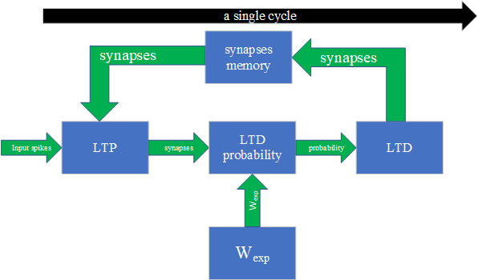

# SNN 扩展指令编程手册
作者： 王九龙

本手册基于Ubuntu 22.04环境编写，推荐使用此版本系统进行环境部署

## 一、准备工作
### 1.克隆项目并配置AM项目需要使用的交叉编译工具

首先需要克隆SNN-AM项目（注意，你需要事先安装好git）：

```shell
$ git clone https://gitee.com/dyingmansworks/snn-am.git
```


运行以下命令来配置AM项目需要使用的交叉编译器

```shell
$ sudo apt install gcc-riscv64-linux-gnu
```

输入
```shell
$ riscv64-linux-gnu-gcc
```
显示
```shell
riscv64-linux-gnu-gcc: fatal error: no input files
compilation terminated.
```
则表示配置完成。

### 2.配置环境变量
打开.bashrc配置文件
```shell
$ vim ~/.bashrc
```
在打开的文件末尾添加`export AM_HOME=<path of snn-am>`，`<path of snn-am>`就是你保存本项目的绝对路径。（关于vim的使用请自行学习，也可以使用其他的编辑器修改该文件）

保存并关闭刚才的文件后输入：
```shell
$ suorce ~/.bashrc
$ $AM_HOME
```

若提示以下信息则配置正确
```shell
bash: <path of snn-am>: Is a directory
```

### 3.编译程序并使用预编译的“文曲星22A”来运行程序

使用以下命令编译程序：
```shell
$ cd snn-am/apps/snn-test
$ make ARCH=riscv64-nutshell
```

编译过程会输出以下信息：
```shell
# Building snntest [riscv64-nutshell] with AM_HOME {<path of snn-am>}
+ CC src/snntest.c
# Building lib-am [riscv64-nutshell]
# Building lib-klib [riscv64-nutshell]
# Creating binary image [riscv64-nutshell]
+ LD -> build/snntest-riscv64-nutshell.elf
+ OBJCOPY -> build/snntest-riscv64-nutshell.bin
```
编译好的程序可以在`build/`目录下找到则表示编译成功。

在本项目中我们提供了一个预编译好的文曲星模拟器用来运行编译好的AM程序。

在项目的根目录下有一个`emu`可运行文件，那就是我们提供的预编译好的文曲星的模拟器。在根目录下使用时可以输入`./emu -h`来查看帮助。

```shell
Usage: ./emu [OPTION...]

  -s, --seed=NUM        use this seed
  -C, --max-cycles=NUM  execute at most NUM cycles
  -i, --image=FILE      run with this image file
  -b, --log-begin=NUM   display log from NUM th cycle
  -e, --log-end=NUM     stop display log at NUM th cycle
  -v, --verbose=STR     verbosity level, can be one of [ALL, DEBUG, INFO, WARN, ERROR]
  -h, --help            print program help info
```

输入以下命令运行编译好的程序:
```shell
$ cd $AM_HOME
$ ./emu -b 0 -e 0 -v ALL -i apps/snn-test/build/snntest-riscv64-nutshell.bin
```

若输出以下结果即运行成功（时间、路径等信息可能不同）：
```bash
The image is apps/snn-test/build/snntest-riscv64-nutshell.bin
[warning] sdcard img not found
===========================
ALL PASSED
===========================
======== PerfCnt =========
               10215 <- Mcycle
                3830 <- Minstret
                   0 <- MultiCommit
                1430 <- MimemStall
                1410 <- MaluInstr
                1028 <- MbruInstr
                1376 <- MlsuInstr
                   0 <- MmduInstr
                   0 <- McsrInstr
                 750 <- MloadInstr
                   0 <- MmmioInstr
                   0 <- MicacheHit
                   0 <- MdcacheHit
                   0 <- MmulInstr
                 258 <- MifuFlush
                 464 <- MbpBRight
                  86 <- MbpBWrong
                 154 <- MbpJRight
                 164 <- MbpJWrong
                   0 <- MbpIRight
                   0 <- MbpIWrong
                 152 <- MbpRRight
                   8 <- MbpRWrong
                   0 <- Ml2cacheHit
                   0 <- Custom1
                  79 <- Custom2
                   0 <- Custom3
                   0 <- Custom4
                   0 <- Custom5
                   7 <- Custom6
                   0 <- Custom7
                   0 <- Custom8
                  17 <- MsnnInstr
                   5 <- MrawStall
                3929 <- MexuBusy
                1931 <- MloadStall
                1685 <- MstoreStall
                4189 <- ISUIssue
======== PerfCntCSV =========

Mcycle, Minstret, MultiCommit, MimemStall, MaluInstr, MbruInstr, MlsuInstr, MmduInstr, McsrInstr, MloadInstr, MmmioInstr, MicacheHit, MdcacheHit, MmulInstr, MifuFlush, MbpBRight, MbpBWrong, MbpJRight, MbpJWrong, MbpIRight, MbpIWrong, MbpRRight, MbpRWrong, Ml2cacheHit, Custom1, Custom2, Custom3, Custom4, Custom5, Custom6, Custom7, Custom8, MsnnInstr, MrawStall, MexuBusy, MloadStall, MstoreStall, ISUIssue, 


               10215,                 3830,                    0,                 1430,                 1410,                 1028,                 1376,                    0,                    0,                  750,                    0,                    0,                    0,                    0,                  258,                  464,                   86,                  154,                  164,                    0,                    0,                  152,                    8,                    0,                    0,                   79,                    0,                    0,                    0,                    7,                    0,                    0,                   17,                    5,                 3929,                 1931,                 1685,                 4189, 


HIT GOOD TRAP at pc = 0x800003b0
total guest instructions = 3830
instrCnt = 3830, cycleCnt = 10215, IPC = 0.374939
Guest cycle spent: 10216
Host time spent: 49ms
```

## 二、使用SNN扩展指令来编写自定义程序

### 1.进入`snn-am/apps`文件夹下新建项目文件夹：

```shell
$ cd $AM_HOME/apps
$ mkdir myproj
$ cd myproj
```

### 2.创建`src`文件夹以及`Mafile`，在`Makfile`中输入以下内容：

```makefile
NAME = myproj
SRCS = $(shell find -L ./src/ -name "*.c" -o -name "*.cpp")
include $(AM_HOME)/Makefile.app
```

### 3.在`src`文件夹下编写你的程序。

关于标准库的调用的规范详见文件：
```
<path of snn-am>/README.old
```

使用SNN扩展指令需要引入相关头文件，在`myproj`目录下输入指令：
```shell
$ cp -r <path of snn-am>/apps/snn-test/include .
```

例如编写一个LIF神经元推理更新的程序：
```c
#include "snn.h"            // SNN 指令内联汇编头文件
#include "snn-ref.h"        // SNN测试输出头文件

// 初始化定义
#define VINIT   (20 << 1)   // 重置电压
#define VTH     40          // 阈值电压(20 << 1)
#define EN      0           // 是否使用STDP更新突触，此处为关闭状态
#define VLEAK   5           // 漏电压

int vneuron[] = {
    VINIT, VINIT, VINIT, VINIT, VINIT
}; // 初始化5个神经元, vneuron[63:1]进行神经元电位运算，vneuron[0:0]作为发放指示位
int vin[] = {
    25, 10, 15, 20, 25
}; // 设置对每个神经元的输入电压

int main(){
    sinit(VINIT, EN);       // 初始化SNN配置
    vleak(VLEAK);
    uint64_t output = 0x0;  // 声明记录5个神经元输出的变量
    for (int i = 0; i < 5; i++){
        vneuron[i] = sge(nadd(vneuron[i], vin[i]), VTH);
        output = sls(output);
    }
    // 预期是神经元0和4进行发放, output = [1 0 0 0 1](0x11)
    nemu_assert(output == 0x11); 
    if(output == 0x11)  PassMassage(); // 输出PASS信息
    else          printf(" test failed\n");
    return 0;
}
```

### 4.编译并运行
返回`myproj`目录，输入以下指令编译程序：
```shell
$ make ARCH=riscv64-nutshell
```

在当前目录下会产生`build/`文件夹，里面就包含了我们需要的程序以及对应的反汇编代码：
```
myproj-riscv64-nutshell.txt    反汇编代码
myproj-riscv64-nutshell.bin    可执行二进制程序
```

输入命令运行程序：
```shell
$ $AM_HOME/emu -b 0 -e 0 -v ALL -i build/myproj-riscv64-nutshell.bin
```

输出结果与第一节中的类似，第一部分提示使用的可执行文件信息
```
The image is build/snntest-riscv64-nutshell.bin
[warning] sdcard img not found
```

第二部分是需要重点关注的输出信息
```
0x11
===========================
ALL PASSED
===========================
```

我们在程序中将output的值打印了出来，可以看出是符合预期的。最后一个部分就是CPU的性能统计数据，包括了各项指令的情况，其中也有关于SNN指令的运行数量，如果你有兴趣，可以看一看。
```
17 <- MsnnInstr

HIT GOOD TRAP at pc = 0x800003d0
total guest instructions = 4250
instrCnt = 4250, cycleCnt = 11615, IPC = 0.365906
Guest cycle spent: 11616
Host time spent: 55ms
```

## 三、SNN扩展指令
### 1.二值SNN介绍

SNN的工作流程分为三个部分，脉冲处理，神经元更新和突触更新。其中脉冲处理用于获得输入神经元的有效脉冲；神经元更新根据输入的有效脉冲、漏电压以及神经元状态更新电压；突触更新使用二值随机STDP（BS-STDP）规则进行更新，其具体流程如下



如果神经元发放，突触会被对神经元发放有贡献的脉冲激活，换言之就是输入脉冲会使得当前对应的突触激活；随后在LTD模块中使用LTD概率来避免过拟合，在CPU中会产生一个随机数。对于每一条激活的突触，若此时随机数的值大于LTD概率，则会保持激活状态；若小于，则会置0。这个概率决定了当前神经元突触的分辨率，越高能被保留的激活的突触数量就越多，反之就越少。LTD概率的计算如下


其中，Wsum是当前神经元激活突触的数量，Wexp是期望的激活突触数量。

### 2.扩展指令

SNN扩展指令使用内联汇编的方式定义在`snn.h`头文件中，使用时直接在程序中调用就可以。

#### a.基本运算相关
```C
uint64_t ands(uint64_t rs1, uint64_t rs2);
/*
    syn = rs1 & rs2
*/
```
`ands`用于脉冲处理阶段将syn寄存器中突触与输入脉冲进行与运算，得到有效脉冲。

```C
uint64_t rpop(uint64_t rs);
/*
    rd = the population of '1' in rs
*/
```
`rpop`用于统计寄存器内“1”的个数

```C
void sinit(uint64_t vinit, uint64_t enable);
/*
    set snn initial parameters, vinit for intial voltage and enable for STDP enable flag
*/
```
`sinit`用于初始化神经元在发放后重置的初始电压，enable用于指示是否启用STDP。

```C
uint64_t vleak(uint64_t src1);
/*
    set vleak register with src1
*/
```
`vleak`用于定义神经元的漏电压参与到神经元更新的运算中。


#### b.神经元相关
```C
uint64_t nadd(uint64_t vneuron, uint64_t vin);
/*
    vneuron = (vneuron[63:1] + vin - vleak) << 1
*/
```
`nadd`用于神经元更新。注意，神经元更新中vneuron[63:1]用于计算，最低位为发放指示位。


```C
uint64_t sge(uint64_t vneuron, uint64_t vth);
/*
    vneuron = vneuron[63:1] >= vth ? {vinit,1} : {vneuron[63:1],0};
*/
```
`sge`用于比较神经元当前电压与阈值电压，若更新后电压大于阈值电压，则会重置神经元电压并发放脉冲；若小于，则保持当前更新后的电压。注意，sge必须和sls连续使用。

```C
uint64_t sls(uint64_t output);
/*
    res = 
            if enbale STDP:
                output >> 1
            if disable STDP:
                output << 1 | spike
*/
```
`sls`执行时，如果当前使能STDP，则将发放结果右移，提供给突触更新模块；若未使能STDP，则左移output并在最低位记录发放。注意，sls和sge必须连续使用，中间不能插入其他指令。


#### c.突触更新相关

```C
uint64_t inf(uint64_t rs);
/*
   set inf register with rs
*/
```
`inf`用于定义当前神经元是否需要进行突触更新，在突触更新前需要使用。

```C
uint64_t sup(uint64_t syn, uint64_t input);
/*
    res = 
            if spike :
                syn | input
            else:
                syn
*/
```
`sup`用于突触更新的LTP（长程增强）过程，如果神经元发放，则将当前神经元的突触与输入脉冲序列进行或运算，将对神经元发放有贡献的突触激活。

```C
uint64_t ltd(uint64_t possibility, uint64_t syn);
/*
    the synapses with value 1 will be modify by the BS-STDP.
    If a random number is smaller than LTD possibility, then synapses will be set to 0.
    possibility = [0,1024]
*/
```
`ltd`用于突触更新的LTD（长程抑制）过程，执行前需要统计被激活突触的数量，并由此计算出一个LTD概率（取值范围0-1024）。执行指令时在CPU中会产生一个随机数，对于每一条激活的突触，若此时随机数的值大于LTD概率，则会保持激活状态；若小于，则会置0。

## 四*、编译文曲星22A
*对编译Chisel不感兴趣可以跳过此部分。
### 克隆文曲星22A源代码
```shell
$ git clone https://github.com/openmantianxing/Wenquxing22A
```

### 下载mill
参考 https://com-lihaoyi.github.io/mill/

### 编译可执行模拟器
```shell
$ cd hw
$ make emu
```
上述命令会启动模拟器并运行`ready-to-run`中的linux.bin模拟启动linux kernal。编译好的可执行文件`emu`在`hw/build`文件夹下。
## 关于文档

### 有任何问题可以通过以下联系方式联系作者
```
  dyingmail@bupt.edu.cn
```


